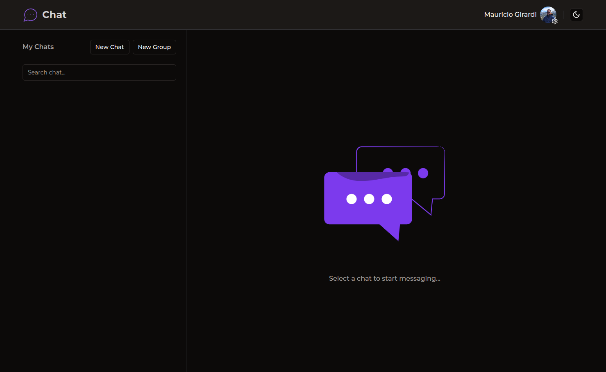

  
  <h2>Chat</h2>

 

## About the project

The project was also created with the aim of practicing the implementation of Socket.io, improving skills and understanding of communication technologies in real time.

Create a real-time communication platform, offering a variety of features and functionalities for users. CLERK authentication is implemented to ensure security in the user registration and login process. Upon logging in, users have access to a list of all registered users in the application, enabling them to initiate individual or group conversations.

Users have the ability to customize their profiles, including adding profile pictures, creating and editing groups. They can view the count of unread messages in their chat list, making it easier to prioritize conversations. The integration of Socket.io provides a real-time chat experience, allowing for immediate sending and receiving of messages.

Additionally, the system includes advanced features such as typing animation to indicate when a user is typing a message, and read receipts to indicate when messages have been read by the recipient. These combined features offer a robust and dynamic platform for communication and collaboration among users.

## Layout Dark

## Layout Light

## Todo

[x] - Implement CLERK Authentication for sign-up and sign-in.

[x] - Logged in users will be able to see all the list of users who registered in the application

[x] - If any user want to chat with other user , they have to add the user to chats list

[x] - Users can create one-to-one chat and also group chats.

[x] - Users can able to update their profile picture , create groups , edit groups.

[x] - Users can see unread messages count in chats-list for every chat.

[x] - Integrating socket io in-order to make all the chat functionalities real time.

[x] - Once the socket io is integrated , users will be able to send and receive the messages in real-time.

[x] - Recipient users can see the typing animation if any user is typing in that chat.

[x] - Read Receipts functionality for the messages.

[ ] - Add unit tests.

[ ] - Separate the back-end from the front-end.

[ ] - Encrypt the messages
